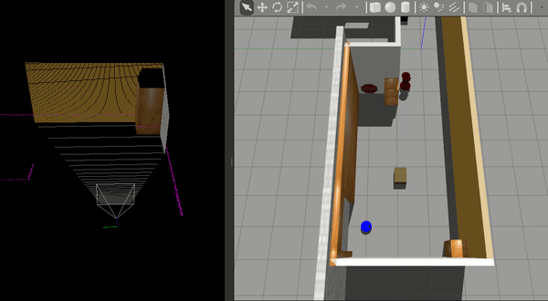
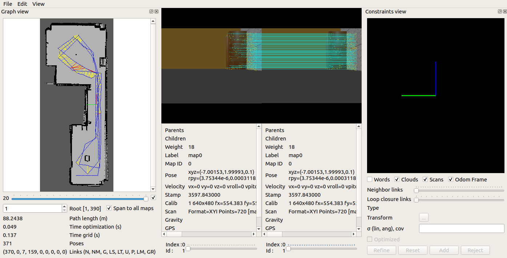

# ROSND Map My World

The project was developed on Ubuntu 18.04 LTS with ROS Melodic, Gazebo and catkin installed.

## Dependencies for Running Locally
* ``rtabmap_ros`` ROS packages, can be install through:
``sudo apt-get install ros-melodic-rtabmap-ros``  

## Basic Build Instructions
1. Clone this repo to your work space e.g. c:/home/workspace/
2. cd /home/workspace/Udacity-RoboND-Map-My-World/
3. catkin_make

## Launch the Project
In seperate terminals:
1. cd /home/workspace/Udacity-RoboND-Where-AM-I/
2. source devel/setup.bash
 
### Launch Gazebo world, teleop and Rviz:
``roslaunch my_robot teleop.launch``

### Launch Rtabmap node:
``roslaunch my_robot mapping.launch``  
``db``  fill will be located in the ~Udacity-RoboND-Map-My-World/src/my_robot/map

### Data Base Viewer:  
View generated db:
``rtabmap-databaseViewer ~/.ros/rtabmap.db``

Yes to using the database parameters  
View -> Constraint View  
View -> Graph View  
Generated db filed was uploaded to [Google Drive](https://drive.google.com/file/d/13_yOIGWSuUqKr1J1IbemEl1dZ3Xq-hFd/view?usp=sharing).

